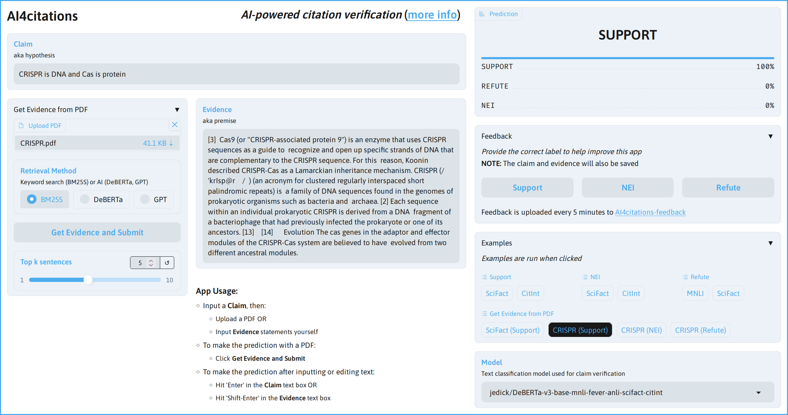

# AI-Powered Citation Verification

A web app for scientific citation verification.
This app was developed as part of an [ML engineering capstone project](https://github.com/jedick/MLE-capstone-project).

Features:

- **Claim verification**: Predict a label from a pair of claim and evidence statements
  - Labels are Support, Refute, or Not Enough Information (NEI)
- **Evidence retrieval**: Input a claim to get evidence from a PDF
- Model selection: Choose from a fine-tuned model (default) or the pretrained base model
  - The [default model](https://huggingface.co/jedick/DeBERTa-v3-base-mnli-fever-anli-scifact-citint) was fine-tuned on two datasets, [SciFact](https://github.com/allenai/scifact) and [Citation-Integrity](https://github.com/ScienceNLP-Lab/Citation-Integrity/)
  - The [base model](https://huggingface.co/MoritzLaurer/DeBERTa-v3-base-mnli-fever-anli) is DeBERTa pre-trained on multiple natural language inference (NLI) datasets
  - See this [blog post](https://jedick.github.io/blog/experimenting-with-transformer-models-for-citation-verification/) for more information on fine-tuning

## Running the app

- Install the requirements with the `pip install -r requirements.txt`
- Run `gradio app.py` to launch the app
- Browse to the generated URL (e.g. `http://127.0.0.1:7860`)

Screenshot of app with [example text](https://huggingface.co/datasets/nyu-mll/multi_nli/viewer/default/train?row=37&views%5B%5D=train):

## Evaluation

Predictions were made on the SciFact test set.

- *Gold evidence* is the abstract from the cited paper used by human annotators to label each claim
- *Retrieved evidence* is sentences retrieved from the PDF of the cited paper
  - The claim was used as the query
  - Sentences were retrieved only from the cited PDF
  - The number of retrieved sentences (top k) was set to 5 or 10

Results:

- Macro F1 with gold evidence: 0.834
- Macro F1 with retrieved evidence (k=5): 0.649
- Macro F1 with retrieved evidence (k=10): 0.654

## Acknowledgments

- App built with [Gradio](https://github.com/gradio-app/gradio)
- [BM25S](https://github.com/xhluca/bm25s) for evidence retrieval 
